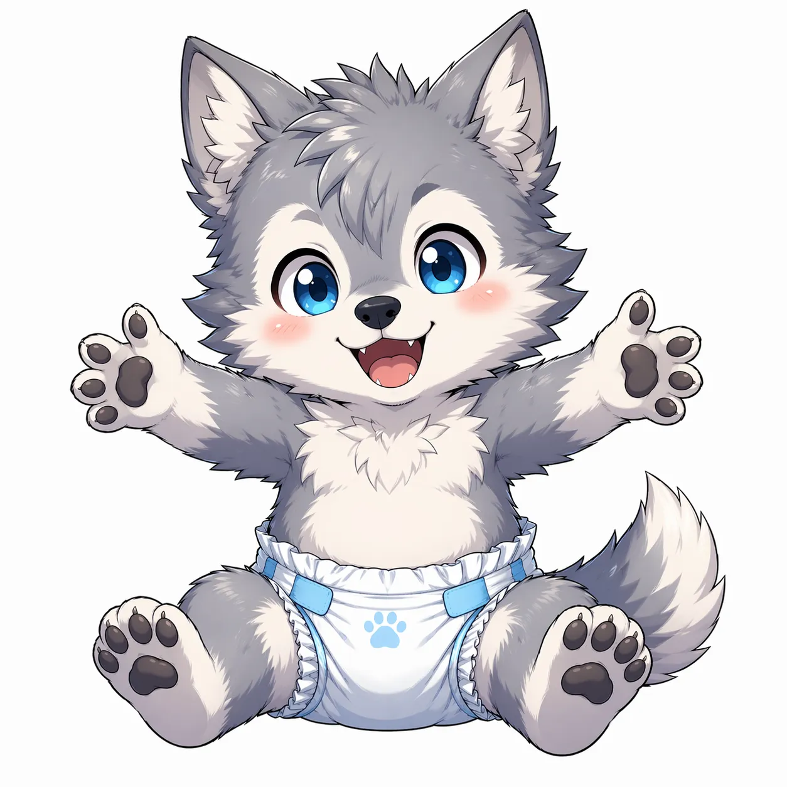

# ぽこあぽこ（poco a poco）
# Claude Code 移行用フィードバックまとめ 最新版

---

## 前提・ファイル構成

作業対象ファイル: `pocoapoco_v1.html`
画像ファイルは同じフォルダに配置済み。

```
pocoapoco/
├── pocoapoco_v1.html
├── wolf_stage0.webp
├── wolf_stage1.webp
├── wolf_stage2.webp
├── wolf_stage3.webp
├── fox_stage0.webp
├── fox_stage1.webp
├── fox_stage2.webp
├── fox_stage3.webp
├── dragon_stage0.webp
├── dragon_stage1.webp
├── dragon_stage2.webp
├── dragon_stage3.webp
├── budgie_stage0.webp
├── budgie_stage1.webp
├── budgie_stage2.webp
└── budgie_stage3.webp
```

---

## 1. キャラクターを4種類に変更

現在の3種類（wolf / fox / dragon）に、新たにセキセイインコ（budgie）を追加する。

### キャラクター一覧（確定版）

| 種別コード | 名前 | 性別 | 個性 | 台詞の文体 |
|---|---|---|---|---|
| wolf | 狼獣人 | ♂ | クール・無口・ツンデレ・実は優しい | 「…悪くない」「まあ、よくやったな」など寡黙でぶっきらぼう |
| fox | 狐獣人 | ♀ | 明るい・元気・おしゃれ・ポジティブ | 「わあ！すごい！」「さすがだね！」など明るくポジティブ |
| dragon | ドラゴン獣人 | 中性 | 神秘的・マイペース・古風・壮大 | 「うむ、よき歩みじゃ」「その積み重ねが力となる」など古風 |
| budgie | インコ獣人 | ♂ | マイペース・のんびり・ゆったり | 「…ふわ〜、すごいねぇ」「いいじゃん、いいじゃん〜」などのほほん |

---

## 2. キャラ選択UIに幼児期画像を表示

初回キャラ選択モーダルで、各選択肢に幼児期の画像を表示して選ばせる。

```html
<!-- 例：狼の選択肢 -->
<div class="animal-option" onclick="selectAnimal('wolf', this)">
  
  <div class="a-name">狼</div>
  <div class="a-desc">クール系・♂</div>
</div>
```

4キャラすべてに同様の処理を適用する。

---

## 3. キャラ画像の組み込み（SVG→imgタグに置き換え）

現在のSVG絵文字によるキャラ表示を、すべてimgタグに置き換える。

### 実装方針

```javascript
// キャラ表示関数
function getCharacterHTML(animalType, stage) {
  const src = `${animalType}_stage${stage}.webp`;
  const fallback = ANIMAL_EMOJI[animalType]; // 絵文字フォールバック

  return `
    
    <span style="display:none;font-size:80px;">${fallback}</span>
  `;
}
```

- 画像が存在しない場合は絵文字フォールバックを表示する
- `mix-blend-mode: multiply` で白背景画像をアプリ背景に馴染ませる

---

## 4. キャラ別台詞の整備（各カテゴリ20種類以上）

現在の共通台詞をキャラクター別に分離・充実させる。

### 台詞カテゴリと文体方針

#### 🐺 狼（wolf）：クール・寡黙・ツンデレ
```javascript
afterRecord: [
  '…悪くない',
  'まあ、よくやったな',
  '…認めてやる',
  'それくらいやれると思ってた',
  '…次も期待してる',
  'ふん。でも、よくやった',
  '…少しだけ、見直した',
  'まあ…合格だ',
  '…そういうところ、嫌いじゃない',
  '黙って続けることが大事だ',
  // ...20種類以上
],
dailyMessage: [
  '…来たか',
  '今日もやるんだな',
  '…ちゃんと来い',
  '休むな、とは言わない。でも来るなら本気でやれ',
  // ...
],
stageUp: [
  '…少し、大きくなったな',
  '成長したな。悪くない',
  '…次の姿か。見せてみろ',
],
feedReaction: [
  '…うまい',
  '悪くない味だ',
  '…ありがとな',
],
cleanReaction: [
  '…きれいになったな',
  '助かる',
  '…悪くない',
],
```

#### 🦊 狐（fox）：明るい・元気・ポジティブ
```javascript
afterRecord: [
  'わあ！すごい！',
  'さすがだね！',
  'それってめちゃくちゃいいじゃん！',
  'えらい！えらすぎる！',
  '最高！もっと聞かせて！',
  'きみのこと、もっと好きになっちゃった！',
  'そういうの大事だよね！',
  'ナイス！ほんとナイス！',
  // ...20種類以上
],
```

#### 🐉 ドラゴン（dragon）：神秘的・古風・壮大
```javascript
afterRecord: [
  'うむ、よき歩みじゃ',
  'その積み重ねが力となる',
  '…小さき一歩が、大きな道となるのじゃ',
  'よくやった。我は見ておったぞ',
  'ふむ…なかなかじゃ',
  'その努力、無駄にはならぬ',
  // ...20種類以上
],
```

#### 🐦 インコ（budgie）：のほほん・のんびり・マイペース
```javascript
afterRecord: [
  'いいじゃん、いいじゃん〜',
  '…ふわ〜、すごいねぇ',
  'まあ、ぼちぼちね〜',
  'のんびりでいいと思うよ〜',
  'ふふ、よかったねぇ',
  '…うん、いい感じだよ〜',
  'そういうのって大事だよね〜',
  'ゆっくりでいいんだよ〜',
  // ...20種類以上
],
```

---

## 5. キャラのリアクションアニメーション

記録送信・ご飯・なでる・掃除などのアクション時に、キャラ画像をCSSアニメーションで動かす。

```css
@keyframes charReaction {
  0%   { transform: translateY(0) rotate(0deg) scale(1); }
  20%  { transform: translateY(-20px) rotate(-8deg) scale(1.05); }
  40%  { transform: translateY(-5px) rotate(6deg) scale(1.05); }
  60%  { transform: translateY(-15px) rotate(-4deg) scale(1.03); }
  80%  { transform: translateY(-3px) rotate(3deg) scale(1.01); }
  100% { transform: translateY(0) rotate(0deg) scale(1); }
}

@keyframes charHappy {
  0%,100% { transform: scale(1); }
  30%     { transform: scale(1.15) rotate(-5deg); }
  60%     { transform: scale(1.1) rotate(5deg); }
}

.character-reaction {
  animation: charReaction 0.8s cubic-bezier(0.34, 1.56, 0.64, 1);
}
.character-happy {
  animation: charHappy 0.6s ease-in-out;
}
```

アニメーションを発火するタイミング：
- 記録送信後 → `charReaction`
- ご飯をあげた後 → `charHappy`
- なでた後 → `charHappy`
- 成長演出時 → `charReaction`（大きめに）

---

## 6. なでるコミュニケーションの追加

ホーム画面のキャラ表示エリアをタップ・クリックすると「なでる」アクションが発動する。

### 仕様
- キャラ表示エリア（`#characterDisplay`）にclickイベントを追加
- キャラのリアクションアニメーション（charHappy）を再生
- キャラ種別に応じた「なでられた時の台詞」をコメントモーダルで表示
- **ポイント加算なし**（純粋なコミュニケーション）
- **1日の回数制限なし**

### なでられた時の台詞（各キャラ10種類以上）
```javascript
petReaction: {
  wolf:   ['…なんだ', '…まあ、悪くない', 'やめろ…と言いたいところだが', '…うるさい。でも嫌いじゃない'],
  fox:    ['きゃ！くすぐったい！', 'えへへ〜', 'もっとやって！', 'やさしいね！'],
  dragon: ['ふむ…悪くないのじゃ', 'うむ…心地よいのじゃ', 'そなた、なかなかやるのじゃ'],
  budgie: ['ふわ〜…きもちいい〜', 'えへ〜', 'ありがと〜', 'ぼーっとしちゃう〜'],
}
```

---

## 7. スコア変更

| アクション | 変更前 | 変更後 |
|---|---|---|
| ご飯をあげる | +10pt | **+5pt** |
| 部屋の掃除をする | +10pt | **+5pt** |

その他のスコアは変更なし。

---

## 8. カラーテーマの全面変更（Ochibaインスパイア）

現在のパステルコーラル系から、落ち着いたティール系に全面変更する。

```css
:root {
  /* 変更後のカラー */
  --bg:           #F5F5F0;  /* 温かみのあるオフホワイト（背景） */
  --surface:      #FFFFFF;  /* カード背景 */
  --accent:       #6BBFB5;  /* メインアクセント（ティール） */
  --accent-light: #7CCBBF;  /* ボタン・明るいアクセント */
  --text:         #333333;  /* メインテキスト */
  --text-muted:   #888888;  /* サブテキスト */
  --border:       #E8E8E3;  /* ボーダー */
  --tag-bg:       #F0F0EB;  /* タグ背景 */
}
```

現在の以下の変数をすべて上記に対応させて置き換える：
- `--cream` → `--bg`
- `--coral` → `--accent`
- `--peach` → `--accent-light`
- `--dark` → `--text`
- `--mid` → `--text-muted`
- `--light` → `--tag-bg`

グラデーションもティール系に統一する：
```css
/* ヘッダーグラデーション */
background: linear-gradient(135deg, #6BBFB5 0%, #7CCBBF 100%);

/* ボタングラデーション */
background: linear-gradient(135deg, #6BBFB5, #7CCBBF);
```

---

## 9. セキセイインコキャラクターの追加（詳細）

種別コード `budgie` として追加する。

### 特徴（実装時の注意点）
- 羽が腕と一体化している（鳥類の構造）
- 対趾足（前後に2本ずつ指があるX字型）
- 水色×白の羽

### ご飯リアクション台詞
```javascript
feedReaction: [
  'もぐもぐ…うまいねぇ',
  'ふわ〜おいしい〜',
  'ありがと〜',
  'えへ、好きだよこれ〜',
],
```

### 掃除リアクション台詞
```javascript
cleanReaction: [
  'すっきり〜、ありがと',
  'きれいになったね〜',
  'ふわ〜、気持ちいい〜',
],
```

---

## 実装の優先順位

1. **カラーテーマ変更**（全体の見た目が変わるので最初に）
2. **キャラ画像の組み込み**（imgタグ置き換え）
3. **キャラ選択UIに画像表示**
4. **budgieキャラクターの追加**
5. **なでる機能の追加**
6. **キャラ別台詞の整備**
7. **リアクションアニメーション**
8. **スコア変更**（+10pt → +5pt）
